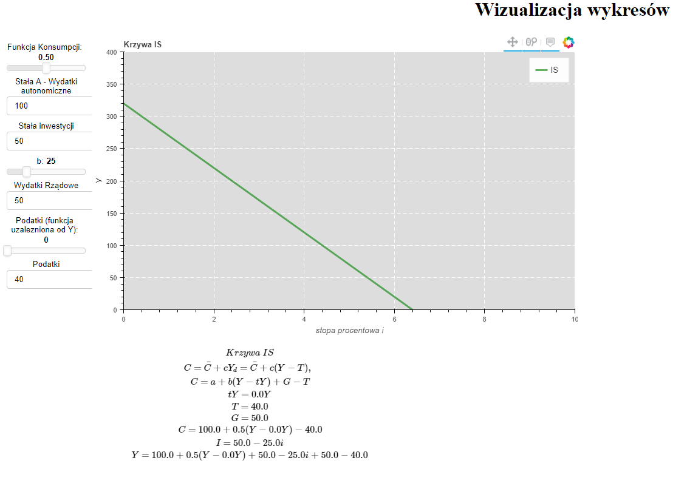
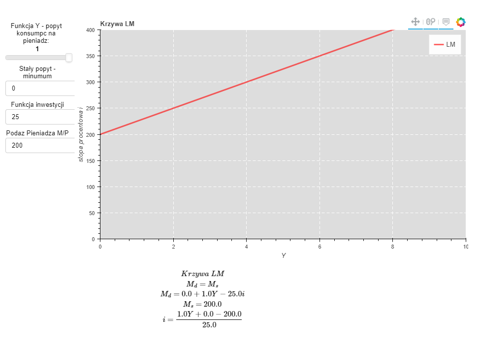
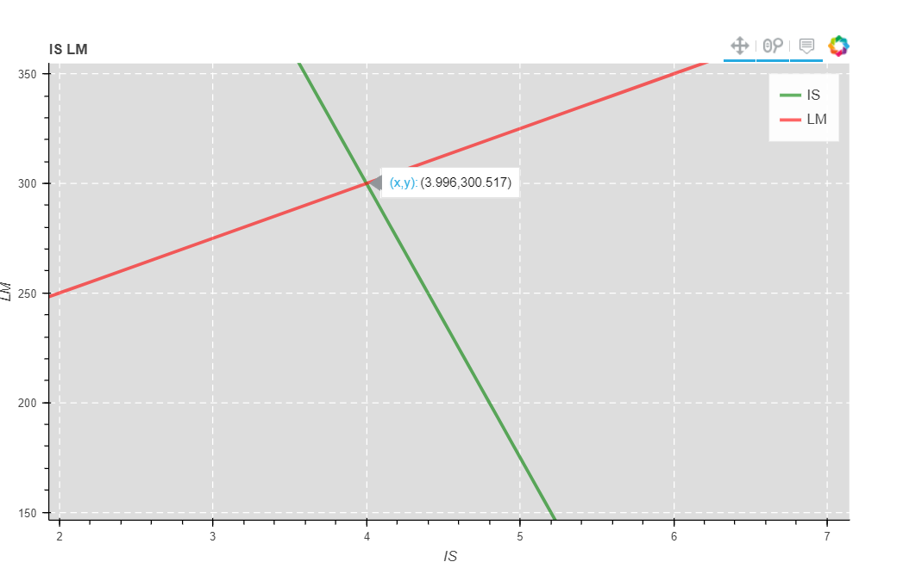

# bokeh_makro

Model showcasing IS-LM model Equilibrium in its' linear version or IS and LM curves.
Build upon 

Known Bugs / TODO List:
1. Async check for JS to re-render LaTeX code - scrolling causes buggy behavior.
2. Fix Server side to not hang up on multiple threads (working, but multithreading hangs in the process list) - possibly deploy by Apache or Nginx.
